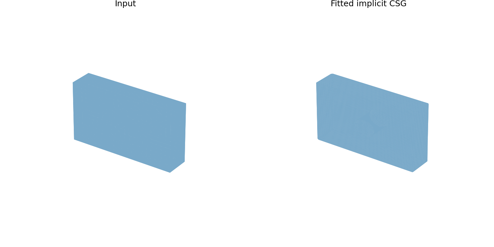
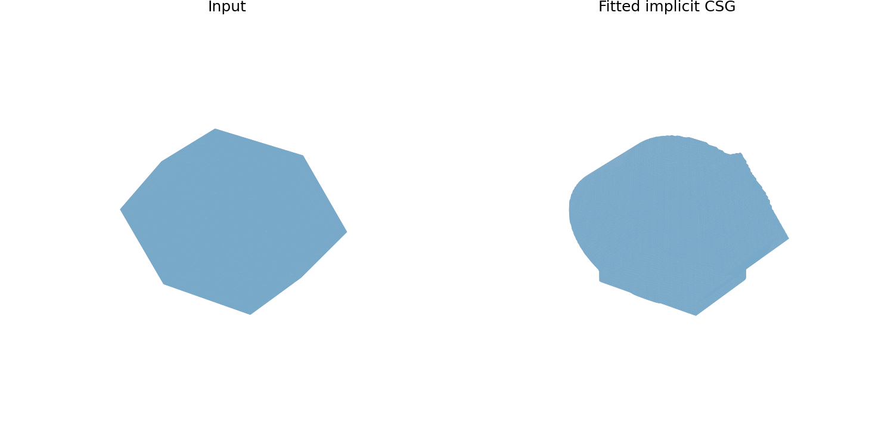
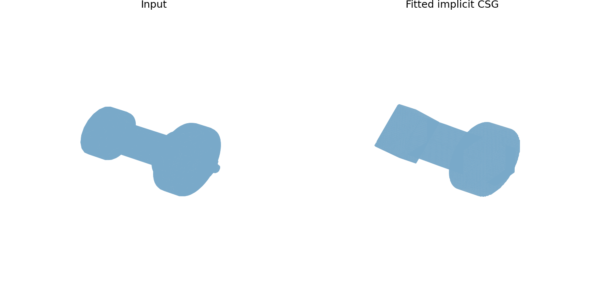
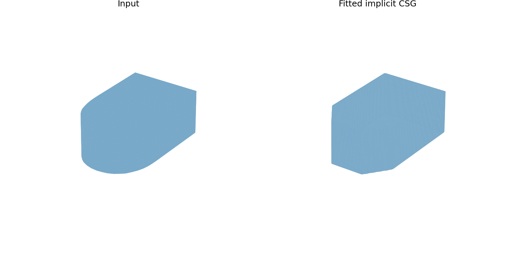
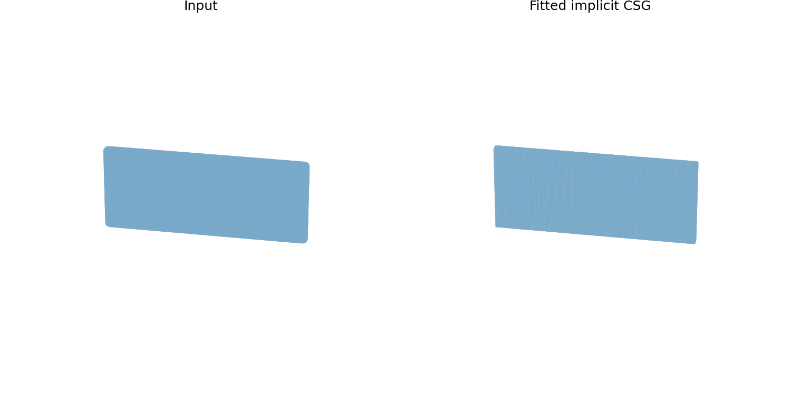
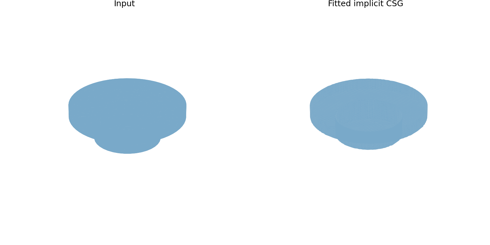
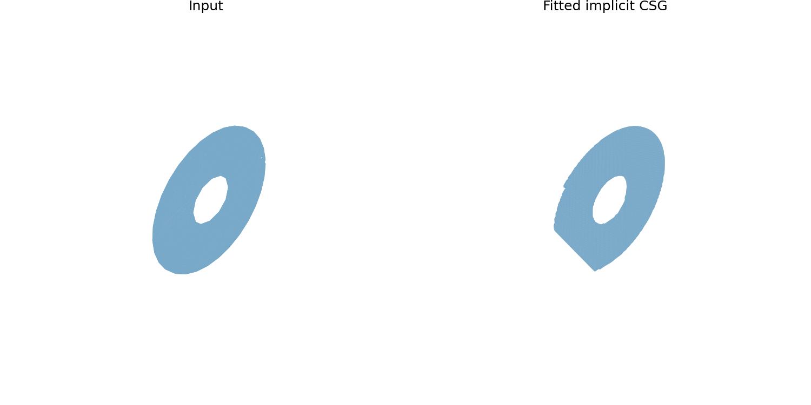
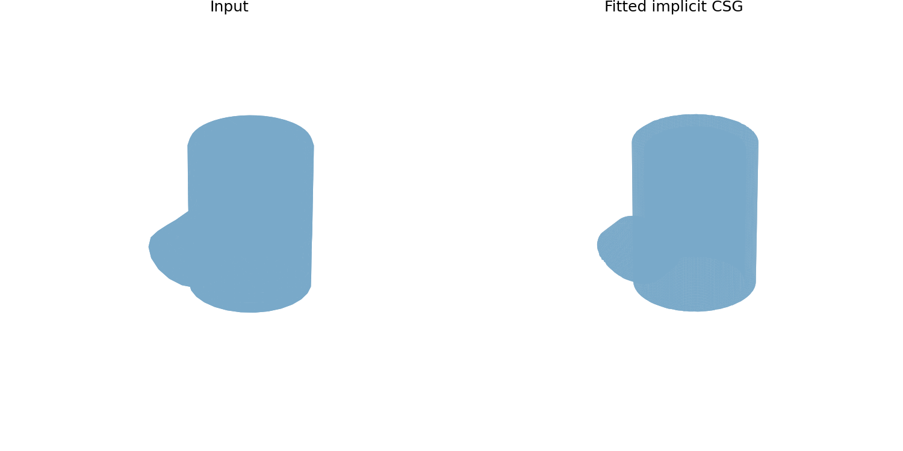
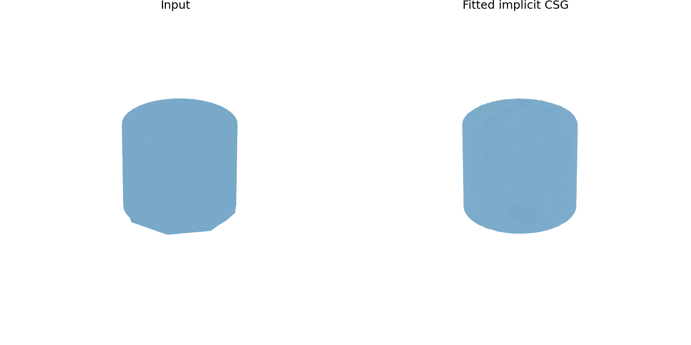

# 九个 Mesh 案例的隐式基元拟合结果

本轮所有案例使用相同设置：随机种子 42、最多 3 个基元；输入只有 OBJ Mesh。以下为几何拟合结果，不代表恢复了原始 CAD 操作。

对比图中，**左侧为输入 Mesh（Input），右侧为拟合结果（Fitted implicit CSG）**。点击图片可查看原尺寸；点击案例名称可查看详细指标与重建文件。

| 难度 | 案例 | 可视化对比（左：输入；右：拟合） | 基元数 | 48³ 体素 IoU | 包围盒基线 IoU | 平均对称表面距离 |
|---|---|---|---:|---:|---:|---:|
| 简单 | [110956_df981ed9_0](easy_110956_df981ed9_0/结果说明.md) |  | 2 | 1.000 | 0.957 | 0.00034 |
| 简单 | [129012_576921da_0](easy_129012/结果说明.md) |  | 3 | 0.966 | 0.751 | 0.00938 |
| 简单 | [23853_4f653200_4](easy_23853_4f653200_4/结果说明.md) |  | 3 | 0.821 | 0.286 | 0.02342 |
| 中等 | [132948_7b65c184_2](medium_132948_7b65c184_2/结果说明.md) |  | 3 | 0.982 | 0.919 | 0.00444 |
| 中等 | [140224_6952f93f_3](medium_140224_6952f93f_3/结果说明.md) |  | 1 | 0.958 | 0.117 | 0.00178 |
| 中等 | [62111_9ba5436e_2](medium_62111/结果说明.md) |  | 3 | 0.951 | 0.400 | 0.00790 |
| 困难 | [109857_1d24326e_6](hard_109857_1d24326e_6/结果说明.md) |  | 3 | 0.614 | 0.698 | 0.01088 |
| 困难 | [138244_f79136e9_0](hard_138244_f79136e9_0/结果说明.md) |  | 3 | 0.812 | 0.225 | 0.00886 |
| 困难 | [96174_fea894a7_0](hard_96174_fea894a7_0/结果说明.md) |  | 3 | 0.979 | 0.611 | 0.00531 |

`109857_1d24326e_6` 的体素 IoU 为 0.614，低于包围盒基线 0.698，是本轮明显失败的案例。三个基元可能不足，优化过程也可能未找到更好的组合。

体素 IoU 越大越好；平均对称表面距离越小越好，单位是数据集坐标单位。每个案例目录均保留参数、重建 STL、对比图、原始指标和拟合过程。
