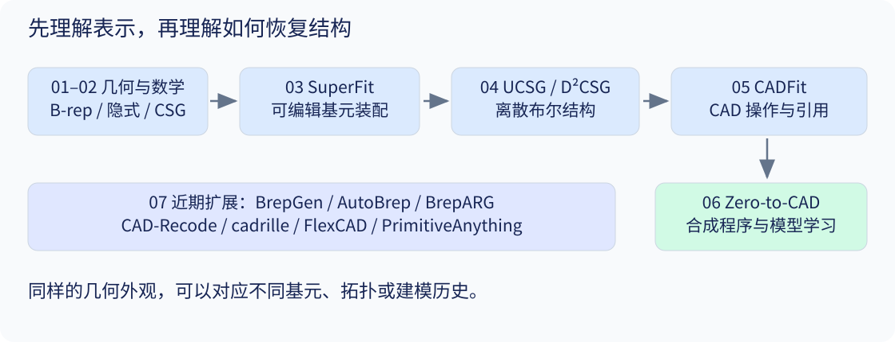

# 00 · 阅读导航：从“形状是什么”到“形状怎么造”

[总目录](README.md) · [下一章](01_representations.md)

## 学习目标

读完后，你应能分清几何表示、基元装配、CSG 树和 CAD 操作序列，并能说出截图里每个资料的用途。

## 1. 四个不同的问题

假设你拿到一个带贯穿孔的长方体。我们可以提出四个问题：

1. **哪里有物体？** 用表面网格或空间占据函数回答。
2. **它由什么几何结构组成？** 用平面、圆柱面、解析基元等描述。
3. **如何用集合运算构造它？** 写成“长方体减去圆柱”。
4. **如何让设计者继续修改？** 写成“带长宽高参数的底座，创建中心孔，指定孔径和贯穿条件”。

前三种结果可能在渲染后几乎一致，但第四种还要维护参数、引用和操作依赖。例如，底座厚度改变以后，孔是否仍然贯穿？这是程序与设计关系的问题，单靠表面误差不能回答。



图中箭头表示学习依赖和可能的处理流程，不表示所有方法都使用同一种中间表示。

## 2. 截图资料逐一对应

| 原始资料 | 讲义位置 | 为什么这样排序 |
|---|---|---|
| nTop：B-rep 与 implicit 入门文章 | 01 | 截图明确建议先读，用于建立表示直觉 |
| CSDN《隐式建模与SDF [1]》 | 01–02 的辅助阅读 | 已成功读取；在 nTop 后读定义、布尔运算，再看 GLSL 示例，注意参考资料中的公式校正 |
| `bardofcodes.../superfit/paper.pdf` | 03，重点 | 正式题名是 *Residual Primitive Fitting of 3D Shapes with SuperFrusta*；截图重复强调“直接相关” |
| UCSG-Net | 04 前半 | 先学连续松弛如何连接几何参数与离散运算 |
| D²CSG | 04 后半 | 再看双分支、补集和结构紧凑性 |
| `arxiv.org/abs/2605.01171` | 05 | 对应 CADFit，输出提升到 CAD 操作序列 |
| Zero-to-CAD | 06 | 最后讨论合成数据、代理执行和模型学习 |

原始链接和完整题名见 [参考资料](references.md)。排序遵循基础到进阶，不把截图第一行当作最先阅读的论文。

## 3. 一条贯穿全文的研究问题

设目标几何为 $S$，构造该几何的程序为 $P$，执行器为 $E$。这里的**程序**是一份“如何生成形状”的描述：包含使用哪些基元、尺寸和位姿，以及如何组合或加工它们。它可以写成几何表达式、CSG 树或 CAD 操作序列，也可以写成代码。

例如，要生成一个带贯穿圆孔的方块，可以用下面的示意程序：

```text
A = 创建方块（边长 2，中心在原点）
B = 创建圆柱（半径 0.5，高度 3，中心在原点，轴线沿 z 轴）
返回 差集(A, B)
```

以上整份构造描述就是 $P$；$E$ 负责执行这些指令；$E(P)$ 是执行后得到的带孔方块。所有尺寸使用同一单位，圆柱高度大于方块高度，因此孔会贯穿方块。若改变圆柱半径，程序参数和生成的孔径也会随之改变。

给定目标形状，我们希望找到：

$$
P^* = \operatorname*{arg\,min}_{P}
\left[
\mathcal L_{\mathrm{geom}}\bigl(E(P),S\bigr)+\lambda C(P)
\right].
$$

| 符号 | 含义 |
|---|---|
| $S$ | 希望重建的目标几何，例如输入 Mesh 所表示的实体 |
| $P$ | 一个候选构造程序，包括操作结构和具体参数；它是优化时要寻找的对象 |
| $E$ | 执行器，将程序中的指令转成几何结果，例如 CSG 求值器或 CAD 几何内核 |
| $E(P)$ | 执行候选程序 $P$ 后得到的形状 |
| $\mathcal L_{\mathrm{geom}}(E(P),S)$ | 几何误差，衡量生成形状与目标形状有多不一致，越小越好 |
| $C(P)$ | 程序复杂度，例如基元数、树大小或操作数；越小表示在所选度量下越简单 |
| $\lambda\geq 0$ | 复杂度项的权重；固定其他定义时，值越大，越重视程序简洁性 |
| $\operatorname*{arg\,min}_{P}$ | 在允许的候选程序中，寻找使方括号内整体目标最小的程序；返回的是程序，而不是最小损失值 |
| $P^*$ | 找到的最优程序；可能不唯一，也不保证等于目标物体最初的建模历史 |

因此，这个公式的意思是：**寻找一份生成形状接近目标、同时复杂度较低的构造程序。** 实际算法可能只能找到近似解。

这是**讲义统一框架**，不是所有论文共用的损失。它把主线拆成三个决定：

- **表示空间：** $P$ 允许什么？球盒装配、SuperFrusta、二次曲面 CSG，还是 CadQuery 程序？
- **搜索方式：** 拟合参数、学习选择权重、几何启发式搜索，还是 LLM 与执行器交互？
- **评价标准：** 几何近似、结构紧凑、执行成功、参数修改稳定，分别测什么？

读论文时先填这三个空，再读网络结构，会容易得多。

## 4. 论文精读顺序与核对问题

每篇按 **前置知识 → 动机 → 贡献 → 方法流程 / Pipeline → 实验 → 局限性** 阅读。先明确任务和贡献，再沿流程图理解公式，最后用实验检验贡献是否得到支持。第 04 章两篇论文分别走完整个顺序；第 07 章提供相同结构的简述。

方法部分应能用“输入 → 运算 → 中间表示 → 输出”复述。实验部分先确认协议，再解释数字。以下六个问题用于核对：

| 问题 | 避免的误解 |
|---|---|
| 输入是水密 Mesh、点云、图像还是体素？ | 把预处理或上游模型提供的信息当成方法自身恢复的能力 |
| 训练是否使用真实程序？ | 将“无程序标签”理解成“没有任何监督信号” |
| 是跨形状训练还是每个形状重新优化？ | 用前向推理速度比较长时间单形状拟合 |
| 连续输出是否真的转成离散程序并执行？ | 把软混合的高 IoU 当成可编辑程序的高 IoU |
| 有效程序是否满足设计意图？ | 把可执行性等同于机械合理性 |
| 数值使用哪个数据子集、对齐和失效统计规则？ | 跨论文直接比较同名指标 |

## 5. 习题

1. 给“带孔底座”写出一个 CSG 表达式和一个 CAD 操作序列。两者各缺少什么信息？
2. 一个程序 IoU 很高，但把孔径修改 10% 后执行失败。它通过了哪种测试，未通过哪种测试？
3. 你要研究“无程序标签的几何分解”，应该先精读哪两章？说明理由。

[答案与提示](exercises_and_answers.md)
