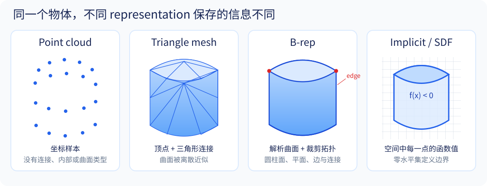
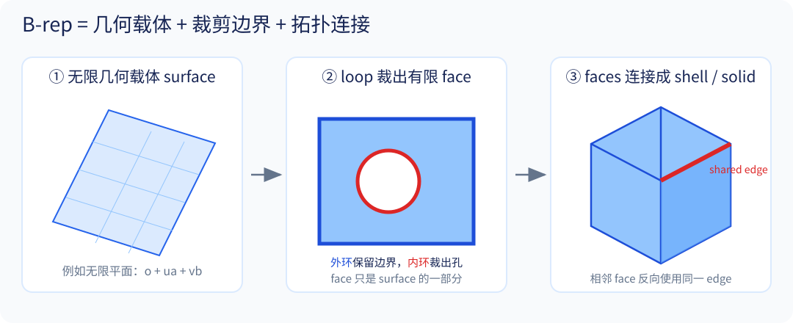
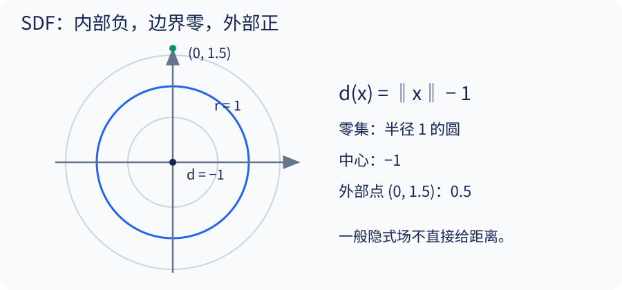

# 01 · 几何表示基础

[总目录](README.md) · [上一章](00_reading_guide.md) · [下一章](02_math_and_optimization.md)

## 学习目标

能够画出 B-rep 的几何—拓扑关系；区分参数曲面与隐式曲面；解释 Mesh 到 CAD 为什么不是简单文件转换。

## 1. 实体、表面与采样不是同一层次

把物体看成有内部的集合 $S\subset\mathbb R^3$，其表面是边界 $\partial S$。点云只是有限采样 $X=\{x_i\}_{i=1}^N$；它通常没有连接关系，也不自动定义内部。Mesh 增加三角形连接关系，但只有满足相应封闭性、定向和无自交条件时，才能稳定地解释成实体边界。

举例：同一组杯子表面点可以来自空心杯，也可以只扫描了实心物体的外侧。不可见区域的信息不足不能靠换一种表示自动消除。

图中四栏描述近似相同的圆柱体。Point cloud 只保存采样坐标；Mesh 再保存三角形连接；B-rep 保存解析曲面及其裁剪拓扑；implicit representation 则通过空间函数的零水平集定义边界。图形外观相近，并不代表它们包含的信息或支持的操作相同。

## 2. B-rep：几何 + 拓扑 + 裁剪

**定义（B-rep）。** 对正则实体 $S\subset\mathbb R^3$，其边界表示写成

$$
\mathcal B=(G,T,\iota),\qquad
\partial S=\bigcup_{f\in F}\iota(f).
$$

其中，$G$ 是曲面和曲线等几何载体；$T=(V,E,F)$ 是由 vertex、edge 和 face 组成的有向二维拓扑复形；$\iota$ 把每个拓扑元素嵌入对应的几何载体。每个 $\iota(f)$ 都是某个参数曲面上由 loops 裁剪出的有限区域。若 $S$ 是封闭实体，则每条非退化 edge 邻接两个 face，且两个 face 沿该 edge 的诱导方向相反；所有 faces 的并集构成 $\partial S$。

| 层次 | 作用 | 带孔底座的例子 |
|---|---|---|
| 几何 surface / curve | 定义连续曲面或曲线 | 平面、圆柱面、圆 |
| 顶点 vertex、边 edge | 定义连接、端点和边界片段 | 孔口圆边、外轮廓直线边 |
| 有向边使用 coedge、环 loop/wire | 描述一个面如何沿边界走一圈 | 顶面的外轮廓环与孔口内环 |
| 面 face | 曲面上被环裁剪出的区域，带方向 | 有圆孔的有限矩形平面区域 |
| 壳 shell、实体 solid | 组织面，并定义空间区域 | 外表面与孔壁共同围住材料 |

一个无限平面无法表达“带圆孔的矩形顶面”；必须补充边界裁剪与内外环。相邻两个面可以共享同一条边，却以相反方向使用它。因此后面的 B-rep 生成方法必须处理拓扑关系，不只是顶点坐标。

从左到右看：surface 是无限延伸的几何载体；外环和内环把它裁成带孔 face；多个 face 沿共享的 edge 连接成 shell，封闭且定向一致的 shell 才能界定 solid。这里红色内环表示孔的边界，红色 shared edge 表示相邻面共享的拓扑实体。

参数曲面的典型形式为

$$
\mathbf s(u,v):D\subset\mathbb R^2\rightarrow\mathbb R^3.
$$

平面可以写成 $\mathbf o+u\mathbf a+v\mathbf b$；圆柱可写成 $(r\cos u,r\sin u,v)$。实际 face 只使用参数域中的裁剪区域。NURBS 等表示可以描述更一般的曲线与曲面，但本讲义不要求先掌握其全部基函数。

这部分直觉可先对照 [nTop 入门文章的 Precise B-reps 小节](https://www.ntop.com/resources/blog/understanding-the-basics-of-b-reps-and-implicits/)，更具体的数据结构可参考 [Open CASCADE 建模数据文档](https://dev.opencascade.org/doc/overview/html/occt_user_guides__modeling_data.html)。

## 3. Mesh：离散几何与分辨率

三角网格可写为 $M=(V,F)$，$V$ 是坐标，$F$ 是三元顶点索引。球的精确曲面可以用一个方程描述，但三角网格需要越来越多的面才能减小误差。

由 CAD 曲面生成网格叫 tessellation。它舍弃了曲面类型、精确参数和多数建模历史。反过来，把很多近似共面的三角形识别成同一个平面、把近似圆柱区域拟合成圆柱面，并恢复裁剪连接，是推断问题。

**易错点：** STEP 常用于交换 B-rep，但“拿到 STEP”通常不等于“拿到原始特征树”。B-rep 也能通过直接建模修改；缺失的是原始参数化历史，而非绝对不可编辑。

## 4. 隐式表示、occupancy 与 SDF

隐式场用空间函数 $f:\mathbb R^3\rightarrow\mathbb R$ 表示形状：

$$
S=\{x:f(x)\leq0\},\qquad \partial S\approx\{x:f(x)=0\}.
$$

最后一个等式需要排除退化零区域等情形；本讲义的常规实体默认零水平集是边界。occupancy 则记成 $\chi_S(x)\in\{0,1\}$，内部为 1。

SDF 是一种特殊隐式场：

$$
d_S(x)=\begin{cases}
-\inf_{y\in\partial S}\|x-y\|_2,&x\in S,\\
\phantom{-}\inf_{y\in\partial S}\|x-y\|_2,&x\notin S.
\end{cases}
$$

**全书约定：内部负、边界零、外部正。** 学习型 occupancy 的“内部为 1”不是符号冲突，而是另一种函数。

以半径 $r$ 的球为例，以下两个场有相同的零水平集：

$$
f(x)=\|x\|_2^2-r^2,\qquad d(x)=\|x\|_2-r.
$$

只有第二个直接给欧氏距离。$\nabla f=2x$，梯度长度随位置变化；SDF 在可微位置满足 $\|\nabla d\|_2=1$。球心处不可微，因此不能说 SDF 处处光滑。这是**讲义推导**，用于纠正把“连续”“可微”“精确距离”混为一谈的情况。

图以二维圆说明：半径 1 的圆上方，$d(0,1.5)=0.5$；中心的值为 $-1$。等距曲线是同心圆。

**实践工具：** [sdfCAD](https://gitlab.com/nobodyinperson/sdfcad) 是基于 SDF、使用 Python 生成三维网格的项目，可作为理解“隐式场 → 显式网格”的实践入口。注意区分生成网格与恢复 CAD 的解析 B-rep、参数化特征树；项目名称中的 CAD 不代表输出自动包含这些结构。

## 5. 距离信息带来了什么？

若 $d$ 是精确 SDF，$\{x:d(x)\leq\delta\}$ 给出向外偏移 $\delta$ 的区域（取 $\delta\geq0$）。但若把一般隐式场 $f$ 减去相同常数，其边界移动的实际距离取决于局部梯度大小。

隐式布尔运算无需显式计算曲面交线，因而有工程优势；代价是提取显式曲面、达到指定误差、恢复拓扑和特征语义仍要额外处理。nTop 的文章是工业入门解释，其中关于规模和可靠性的论述应理解为其场景下的经验与产品观点，不能推广成任何实现永不失败的数学定理。

## 6. 解析隐式与神经隐式

解析场如球、盒子的公式由少数参数控制；神经场使用 $f_\theta(x)$ 或 $f_\theta(z,x)$。后者表达能力强，但一个神经网络权重通常不对应“孔径”或“壁厚”。本讲义直接解释这个基础概念，不额外要求阅读早期神经隐式论文；SuperFit 追求的是少量可解释参数与可优化性的结合。

| 表示 | 最自然的操作 | 恢复结构的困难 |
|---|---|---|
| 点云 | 采样、邻域、匹配 | 缺连接、内外和完整边界 |
| Mesh | 渲染、表面处理 | 缺解析基元和构造历史 |
| B-rep | 精确曲面与拓扑操作 | 不一定有原始特征与约束 |
| 隐式场 | 内外查询、布尔组合 | 显式拓扑与编辑语义不直接给出 |
| CSG 树 | 改基元参数和集合关系 | 不一定对应真实机械特征历史 |
| CAD 程序 | 修改参数、重放依赖 | 需要有效引用、约束和内核执行 |

## 7. 原文阅读与习题

先读 nTop 的 Precise B-reps → Meshes → Distance fields → Implicits versus distance fields，再查术语表。不要把 nTop 在部分段落中将 meshes 也宽泛称为 B-reps 的用法带到论文比较表中；这里区分解析 B-rep 与三角 Mesh。

1. 半径 2 的球上，点 $(3,0,0)$ 的 $f(x)$ 与 $d(x)$ 各是多少？
2. 为什么“平面方程 + 圆柱面方程”不足以描述带孔底座的完整 B-rep？
3. 若把 $f(x)=\|x\|^2-1$ 改为 $f(x)-0.1$，半径增加多少？是否为 0.1？
4. Mesh 上每个三角形都有法线，为什么仍不能直接断言它定义有效实体？

[答案与提示](exercises_and_answers.md)
