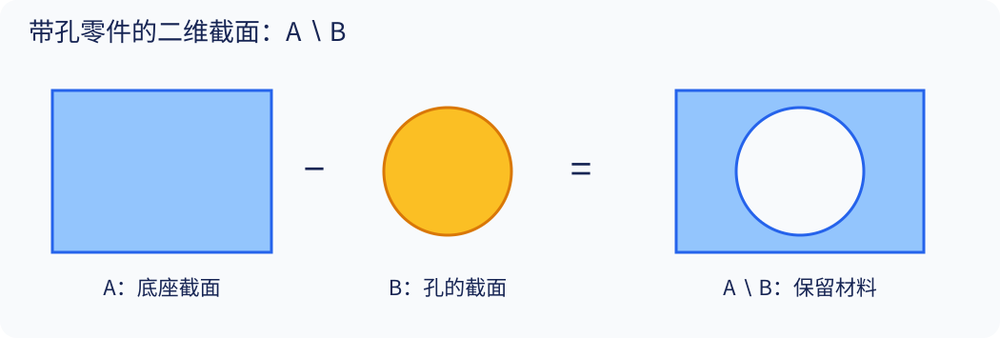

# 02 · CSG、距离场与优化的数学基础

[总目录](README.md) · [上一章](01_representations.md) · [下一章](03_superfit.md)

## 学习目标

会从集合成员关系推导隐式布尔运算；知道哪些操作保留符号、哪些保留距离；能解释为什么结构推断比固定结构参数拟合更难。

## 配套阅读：截图中的 CSDN 文章

[《隐式建模与SDF [1]：技术原理、布尔运算与应用实践》](https://blog.csdn.net/nergiveup/article/details/162848403)已于 2026-09-17 成功读取。可先看其 §2 的定义，再对照 §3 的布尔运算与本章推导。它的 §4 提供 GLSL 示例，适合连接数学表达和渲染实现。

阅读时留意：博客 §2.2 的盒子公式漏了内部负距离项，而 §4.1 的代码包含该项；请以本章下方完整公式为准。博客的指数平滑使用 $k=1/\tau$，不要与多项式平滑的同名参数混用。光线按距离前进的安全性需要精确距离或经过证明的保守距离界；仅有正确零水平集还不够。这里沿用博客作为入门材料，不增加其末尾列出的旧论文阅读任务。

## 1. 基元与坐标变换

基元是一族参数化形状 $S_\theta$。球由半径控制，盒子由三个半边长控制。世界坐标点 $x$ 先转入基元局部坐标：

$$
q=R^T(x-t),\qquad R^TR=I,\quad\det R=1.
$$

刚体变换保距离，因此 $d_{RS+t}(x)=d_S(q)$。若整体再均匀放大 $s>0$：

$$
d_{sRS+t}(x)=s\,d_S\!\left(R^T(x-t)/s\right).
$$

这个外面的 $s$ 容易漏掉。对于非均匀矩阵 $A$，直接算 $d_S(A^{-1}x)$ 通常只有正确的零水平集，不能视作世界坐标下的精确欧氏距离。

球和轴对齐盒子的精确距离公式为：

$$
d_{\mathrm{sphere}}(q)=\|q\|_2-r,
$$

$$
v=|q|-b,\qquad
d_{\mathrm{box}}(q)=\|\max(v,0)\|_2+\min(\max(v_x,v_y,v_z),0).
$$

盒子外部由最近的面、边或角决定距离，内部由最近的面决定。可以对照 [Inigo Quilez 的距离函数资料](https://iquilezles.org/articles/distfunctions/)，再运行本讲义算例。

## 2. 从逻辑推导 CSG

CSG 以基元为叶节点，以并、交、差为内部节点。对于内部负的场 $f_A,f_B$，成员关系给出：

$$
f_{A\cup B}(x)=\min(f_A(x),f_B(x)),
$$

$$
f_{A\cap B}(x)=\max(f_A(x),f_B(x)),\qquad
f_{A\setminus B}(x)=\max(f_A(x),-f_B(x)).
$$

**讲义推导：** 并集只要求至少一个值非正，所以取最小；交集要求两者都非正，所以取最大；差集要求在 A 内且在 B 外，所以翻转 B 的符号。边界取等号时要采用一致的实体约定。CAD 中常用正则化集合运算，去除孤立点、悬空面等低维残留；本章公式针对常规体积区域及其边界，采样评价忽略测度为零的边界差异。

我们的贯穿例子：

$$
S=\operatorname{Box}(b)\setminus\operatorname{Cylinder}(r,h).
$$

圆柱沿 z 轴，半高 $h$ 大于盒子半高，构成贯穿孔。

图是三维带孔零件的二维截面；右侧是矩形减去圆盘，并非圆柱在任意方向的截面。

## 3. 正确形状不意味着正确距离

取二维半平面 $A=\{x\leq0\}$、$B=\{y\leq0\}$，其 SDF 为 $d_A=x,d_B=y$。交集是左下象限。对点 $(1,1)$：

$$
\max(d_A,d_B)=1,\quad
\operatorname{dist}((1,1),A\cap B)=\sqrt2.
$$

因此 max 给出正确内外与边界，却低估到角点的距离。不能从“每个叶节点是精确 SDF”推出“整棵树仍是精确 SDF”。把这类组合场用于 sphere tracing、法线或距离损失时，应核对距离界和梯度条件。

平滑并的一种常用**教学公式**是：

$$
\operatorname{smin}_\tau(a,b)=-\tau\log(e^{-a/\tau}+e^{-b/\tau}),\quad\tau>0.
$$

$$
\min(a,b)-\tau\log2\leq\operatorname{smin}_\tau(a,b)\leq\min(a,b).
$$

证明只需提出 $e^{-\min(a,b)/\tau}$。在 $a=b=0$ 时输出 $-\tau\log2$，所以平滑改变了表面。它并非精确布尔运算；也不是 SuperFit 所有实现细节的替代公式。

## 4. 采样与几何损失

训练通常无法对整个连续空间积分，而是在域 $\Omega$ 内取点 $x_i$。占据重建的一种损失为：

$$
\mathcal L_{\mathrm{occ}}=\frac1N\sum_i\big(o_\theta(x_i)-\chi_S(x_i)\big)^2.
$$

这是讲义示例；不同论文使用不同形式。只采均匀点会忽略很薄的结构，只采表面附近又可能遗漏远处伪几何，因此常混合体积采样和表面邻域采样。

对表面点集 $X,Y$，本讲义把**平方距离、双向求和**的 Chamfer 写为：

$$
\mathrm{CD}_2(X,Y)=\frac1{|X|}\sum_{x\in X}\min_{y\in Y}\|x-y\|_2^2+
\frac1{|Y|}\sum_{y\in Y}\min_{x\in X}\|x-y\|_2^2.
$$

第一项惩罚预测偏离目标，第二项惩罚未覆盖的目标。若只保留第一项，预测一个很小但恰好落在目标上的区域就可能取得低损失。原论文的 CD 可能不平方、乘系数或再除以 2；读表前必须查定义。

体积 IoU 为：

$$
\mathrm{IoU}(A,B)=\frac{\mu(A\cap B)}{\mu(A\cup B)}.
$$

若使用同一批均匀空间样本，可用占据交并计数估计。IoU 不直接惩罚程序长度，也可能对窄孔不敏感。学习时的 soft IoU 与离散体积 IoU 不是同一个量。

## 5. 固定结构的拟合：一个可解例子

给定中心 $c$ 和半径未知的球，目标点全在球面上。考虑：

$$
L(r)=\frac1N\sum_i(\|x_i-c\|_2-r)^2.
$$

求导并令零：

$$
\frac{\partial L}{\partial r}=\frac2N\sum_i(r-\|x_i-c\|_2)=0
\quad\Longrightarrow\quad r^*=\frac1N\sum_i\|x_i-c\|_2.
$$

这是固定中心、已知基元类型、已知点归属下的简单情况。若中心、旋转、基元类型、各点属于哪个部件也未知，优化会出现多解与局部极小。

两个球去拟合杯子时，继续降低学习率无法让球突然具备“杯壁厚度”参数。表示能力和搜索策略是两个不同瓶颈，这正是 SuperFit 一章的入口。

## 6. 结构搜索与连续松弛

设 $T$ 为离散树，$\theta$ 为连续几何参数：

$$
\min_{T,\theta}\mathcal L(E(T,\theta),S)+\lambda C(T).
$$

结构变量无法直接按普通连续参数处理。一种策略是把“选择第 k 个候选”改成 softmax 权重：

$$
w_i=\frac{e^{\ell_i/\tau}}{\sum_j e^{\ell_j/\tau}},\qquad
o(x)=\sum_iw_i o_i(x).
$$

这允许梯度通过候选，但训练中的混合场未必对应任何一个合法离散选择。随着温度降低，通常更接近 one-hot，同时优化可能更脆弱；必须评价离散化后执行的结果。

UCSG-Net 使用 Gumbel-Softmax 做操作数选择；D²CSG 则使用可学习选择矩阵并分阶段离散化。它们不共享同一种松弛。

## 7. 从误差到研究评价

至少同时报告几何误差、表示复杂度、执行有效率和时间。若研究“可编辑”，再增加参数扰动后重执行、约束保持、特征语义和用户任务测试。不要用给变量起名字代替编辑质量评估。

阅读位置：UCSG-Net §2.1 Eqs. (1)–(7)；D²CSG §3；SuperFit §3；CADFit §3 与 Appendix B。这些是本章通用数学在不同系统中的具体用法。

## 8. 习题

1. 在半平面反例中，改用点 $(2,1)$，max 值与真实距离各是多少？
2. 将单位球放大三倍，写出其世界坐标 SDF，并说明漏乘缩放系数会发生什么。
3. 令 $X=\{(0,0,0)\}$，$Y=\{(0,0,0),(2,0,0)\}$，计算单向项和 $\mathrm{CD}_2$。
4. 两个程序 IoU 分别为 0.96、0.95，基元数为 20、5。使用 $\mathrm{IoU}-\lambda K$，何时偏好后者？
5. 两个相同场做平滑并，为什么表面会外扩？

[答案与提示](exercises_and_answers.md) · [可运行算例](examples/README.md)
