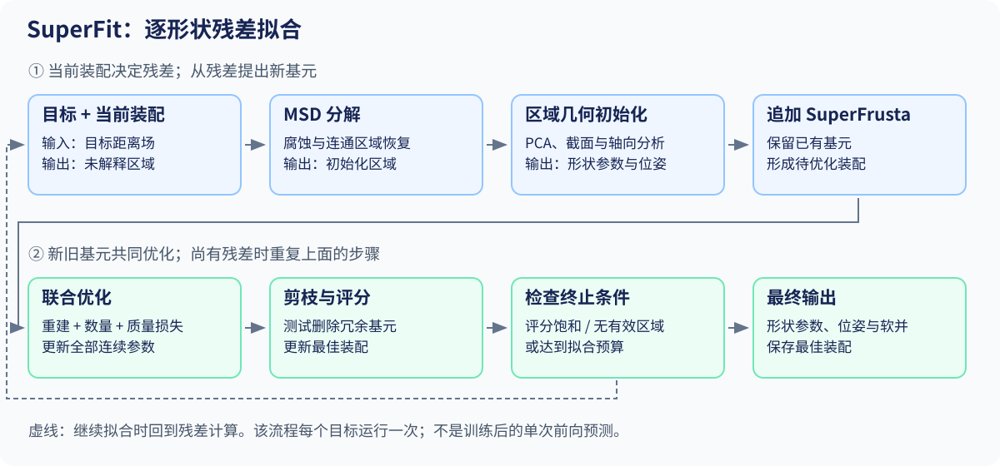

# 03 · SuperFit：可编辑基元与残差拟合

[总目录](README.md) · [上一章](02_math_and_optimization.md) · [下一章](04_neural_csg.md)

**核心论文：** Ganeshan 等，*Residual Primitive Fitting of 3D Shapes with SuperFrusta*，Brown University / Adobe Research。[项目页](https://bardofcodes.github.io/superfit/) 标注 CVPR 2026；[arXiv v1](https://arxiv.org/abs/2512.09201v1) 发布于 2025-12。正文核对作者的 [低分辨率 PDF](https://bardofcodes.github.io/papers/superfit/paper_lowres.pdf)，细节核对 [补充材料](https://bardofcodes.github.io/papers/superfit/supp.pdf)。

## 1. 前置知识

先读 [几何表示](01_representations.md) 中的 implicit / SDF，以及 [数学与优化](02_math_and_optimization.md) 中的坐标变换、软并、采样损失和复杂度惩罚。

| 前置知识 | 在本文中的用途 |
|---|---|
| 局部坐标与刚体变换 | 将一个参数化基元放到世界坐标中 |
| 隐式场、SDF 与零水平集 | 定义基元并查询目标几何误差 |
| Soft union | 平滑地组合多个基元并传播梯度 |
| PCA、连通分量、腐蚀 | 从残差区域初始化位置、方向和尺度 |
| 梯度优化与离散剪枝 | 同时调整连续参数和基元数量 |

### Superquadric 与 superellipsoid

以 superellipsoid 为例，一种常用隐式形式是：

$$
\left(\left|\frac{x}{a_1}\right|^{2/\epsilon_2}+
\left|\frac{y}{a_2}\right|^{2/\epsilon_2}\right)^{\epsilon_2/\epsilon_1}
+\left|\frac{z}{a_3}\right|^{2/\epsilon_1}=1,
\quad a_i,\epsilon_i>0.
$$

当 $\epsilon_1=\epsilon_2=1$ 时是椭球。改变指数可使轮廓更方或更尖；这为连续形状变形提供少量参数。此处作为读懂 SuperFit 的数学先修直接讲解，不另加早期论文阅读任务。

**讲义分析：** 这个隐式等式的左边减 1 一般不是欧氏 SDF。有限指数逼近立方体与精确表达立方体也不同。Superquadrics 是一个广泛家族，不应把本节的 superellipsoid 公式当作所有超二次曲面的定义，更不能与 D²CSG 的七系数 quadric 混淆。

## 2. 动机

输入一个三维形状，输出一组可变换、可编辑的解析基元，其组合逼近输入。这里的“无监督”是没有真实部件分解或基元程序标签；目标形状的几何仍提供拟合信号。ResFit 是逐形状分析与优化，不是训练一个网络后一次前向输出所有结果。

正文 §3 Eqs. (1)–(2) 用以下形式表达目标：

$$
z^*=\arg\max_z O(S,z),\qquad
O(S,z)=R(S,E(z))-\alpha|z|.
$$

$R$ 表示重建质量，$|z|$ 是基元数量。不要把它与优化时的可微 surrogate loss 混为一谈。一个用于选择程序的离散评分，可以通过另一套更易优化的连续损失间接改善。

**教学例子：** 一把玩具椅有厚坐垫、细椅腿和弯曲靠背。仅增加球或盒子的数量可能降低表面误差，却得到互相穿插的碎片。先固定错误分割再拟合，同样会让本可由一个弯曲基元解释的靠背被切碎。

## 3. 贡献

论文的贡献由表示、初始化和拟合三部分组成（正文 §3、Fig. 2）：

| 贡献 | 解决的具体问题 | 对应验证 |
|---|---|---|
| SuperFrustum 参数化基元 | 少量参数同时控制圆角、锥度、弯曲和壳状结构，减少用很多简单基元拼曲面的需求 | Table 2 的基元与软并消融 |
| 适配已有 MSD（Morphological Shape Decomposition）用于初始化 | 利用厚度与连通结构为非凸、弯曲基元提供初始化区域 | Table 3 的 MSD / CoACD 对照 |
| ResFit 残差拟合 | 反复补充未解释区域，全体参数重优化并删除冗余基元 | Table 3 的 single-shot / ResFit 对照 |

MSD 是已有形态学分解方法；本文贡献在于将其适配为 SuperFrusta 的初始化，并纳入残差拟合流程。紧凑性来自重建、基元数量和装配质量的联合约束；八参数基元本身不保证最少基元分解。

## 4. 方法流程 / Pipeline

**输入：** 目标形状及其采样距离场。**输出：** SuperFrusta 的形状参数、位姿和软并装配。**执行方式：** 每个目标单独优化。



图中一次循环接收当前残差，产生新的初始化基元，再更新整个装配；终止后输出保存的最佳装配。

| 步骤 | 输入 → 操作 → 输出 |
|---|---|
| 1 | 目标距离场 → 计算尚未解释的区域 → 残差场 |
| 2 | 残差场 → MSD 腐蚀、连通区域恢复 → 初始化区域 |
| 3 | 区域几何 → PCA 与形状参数初始化 → 新 SuperFrusta |
| 4 | 新旧基元 → 联合优化重建、数量和质量损失 → 更新装配 |
| 5 | 更新装配 → 尝试剪枝并评分 → 最佳装配；继续处理残差 |

### 4.1 SuperFrustum 的定义与距离查询

正文 §3.2 Eq. (3) 写成 $\theta=(s,r,d,t,b,o)$。$s$ 是三维，所以共有八个标量，**不包含刚体位姿和装配混合参数**。

| 参数 | 维数 | 几何作用 | 直觉 |
|---|---:|---|---|
| $s=(s_x,s_y,s_z)$ | 3 | 三轴尺寸 | 拉长、变宽、变高 |
| $r$ | 1 | 截面圆角 | 方截面向圆截面过渡 |
| $d$ | 1 | 膨胀 | 改变外表面偏移 |
| $t$ | 1 | taper | 沿轴变细或变粗 |
| $b$ | 1 | bulge / 弯曲控制 | 形成弧状轴向变化 |
| $o$ | 1 | onion / hollowing | 控制壳状结构 |

补充材料使用 $c$ 表示正文的弯曲/bulge 控制。本章记为 $b$，引用补充公式时显式提醒这一差异。项目代码的 SuperGeon 等后续扩展不是本篇八参数定义的一部分，参见 [官方代码说明](https://github.com/BardOfCodes/superfit/blob/master/notes/primitives.md)。

#### 4.1.1 从二维距离拼出三维形状

补充材料 §2 的构造可以按以下步骤理解：

$$
p^*=\operatorname{DomainCurve3D}(p;s_z,b),
$$

$$
u=\operatorname{RoundedRect2D}(p^*_{xy};s_x,s_y,r),
$$

$$
v=\operatorname{Trapezoid2D}((u,p^*_z);s_z,t,o),\qquad
f(p;\theta)=v-d.
$$

先把三维点映射到弯曲局部域，再计算它相对横截面的二维距离。接着把“横截面距离”和“轴向位置”组成新的二维坐标，在这个空间用梯形约束控制锥度与壳厚。最后加入膨胀。理解这个组合关系比直接记住展开后的长公式更重要。

#### 4.1.2 推导一个可核验的组成块：圆角矩形

设二维半边长 $h=(h_x,h_y)$，$0\leq r\leq\min(h_x,h_y)$。先把矩形收缩到 $h-r$，再膨胀半径 $r$：

$$
q=|p_{xy}|-(h-r),\qquad
d_{\mathrm{rr}}(p)=\|\max(q,0)\|_2+
\min(\max(q_x,q_y),0)-r.
$$

这是由第 02 章盒子公式得到的**讲义推导**，对应补充材料 §2.1 的构造。例：$h=(2,1),r=0.25$，点 $(2,0)$ 在外侧直边上，代入后距离为 0。圆角改变角部而保持外包络尺寸。

#### 4.1.3 梯形距离为什么涉及投影？

对边段 $[A,B]$，最近点由

$$
\eta=\operatorname{clip}\left(\frac{(p-A)\cdot(B-A)}{\|B-A\|^2},0,1\right),
\quad q=A+\eta(B-A)
$$

得到。到四条边的最小距离给绝对值，再通过半空间测试判断内外。**按本讲义内部负约定**，内部取负、外部取正。不要只复制公式而忽略符号：补充材料 §2.2 的符号判别叙述与最后的 `sign(-C)` 写法存在表面不一致，若 $C\leq0$ 被定义为内部，就应采用负的内部距离。这里以几何定义校验结果。

#### 4.1.4 关键限制：采用的是近似距离场

补充材料开头把构造称为 exact SDF，但 §2.6 的 “On SDF accuracy and exact formulations” 明确说明实际采用的是近似距离场；更严格的精确方案计算昂贵，并不自然支持全部 onion/bending 操作。因此本讲义将最终场记作 $f$，不把所有参数设置下 $\|\nabla f\|=1$ 当成定理。

连续、几乎处处可微、数值上足以支持拟合，和数学上的精确距离是三个不同属性。第 02 章的组合反例正是读懂这一点的准备。

### 4.2 MSD 初始化

正文 §3.3 Eqs. (5)–(6)，补充材料 §4 Algorithm 2。

对内部负的目标距离场 $d$，取负阈值 $\ell$：

$$
M_\ell=\{x:d(x)\leq\ell\},\qquad\ell<0.
$$

这相当于腐蚀：距离边界不够远的薄区域先消失，较厚区域留下。算法遍历腐蚀层级，寻找满足最小规模条件的连通区域，再向原边界膨胀，作为初始化区域。

**教学例子：** 玩具椅的细腿在深腐蚀时消失，厚坐垫留下。用恢复后的坐垫区域初始化基元，比随机把一个基元放到椅子包围盒中央更有结构信息。对于弯曲管状部件，厚度一致并不要求其凸；这使 MSD 与可弯曲基元更匹配。

需要注意三个实现含义：

- 一次 MSD 可给出多个合格连通区域，轮数不等于基元数。
- 减去已解释区域后，应重新距离化并清理细小残留；不能默认相减后的隐式值还是原来的精确距离。
- 初始化用区域点云的 PCA 坐标系，并评估候选轴的截面稳定性、圆度和细长度；之后这些参数仍会优化，不是永久锁定的分割。

### 4.3 ResFit 迭代

以下是对正文 §3.1 和补充材料 Algorithm 1 的**教学伪代码**，省略了阈值及内部采样，不可直接当成复现实现：

```text
assembly = empty
best = empty
repeat within fitting budget:
    residual = target minus explained geometry
    regions = MSD(residual)
    if no valid regions: stop
    new_parts = initialize from regional geometry
    assembly = assembly + new_parts
    optimize ALL parts jointly with local-support losses
    prune parts whose removal improves reconstruction-complexity score
    retain best-scoring assembly
    stop when score saturates
return best
```

这里的 residual 是目标尚未解释的空间，不是“每个点的梯度值”。全装配重优化意味着早期坐垫基元可以在细腿加入后重新收缩，不必把早期错误永远固定。

### 4.4 损失与剪枝

正文 §3.4 Eq. (8)：

$$
L=L_{\mathrm{rec}}+\lambda_{\mathrm{count}}L_{\mathrm{count}}
+\lambda_{\mathrm{qual}}L_{\mathrm{qual}}.
$$

重建部分使用体积和近表面信号，强调曲率较高的区域，并限制到当前装配相关的空间带。补充 §5 Eq. (12) 进一步区分均匀体积 occupancy、表面零值和表面邻域 occupancy 三类信号。应按补充细节理解正文较简洁的写法。

每个基元有随机存在变量 $q_i$，用 Gumbel-Softmax 松弛决定保留程度：

$$
f_i^*(p)=q_i f_i(p)+(1-q_i),\qquad
L_{\mathrm{count}}=\sum_iq_i.
$$

当 $q_i=0$，该基元场成为正的常数，不再表示内部区域；中间值会影响形状，不是单纯给渲染透明度赋权。质量项还抑制多基元重叠和过度平滑连接。连续阶段后，再实际尝试删除基元，仅保留对目标评分有益的删改。

**参数核验提醒：** 正文 implementation details 与补充材料部分损失权重叙述不同。讲义不提供拼接出的“统一复现配置”；复现时需选定代码提交、配置和论文版本。这里关注机制，不把某个权重数字当成跨版本默认值。

### 4.5 装配输出与 CSG 扩展

主方法按正文 Eq. (4) 递归组合软并：

$$
F_{k+1}(p)=U(F_k(p),g_{k+1}(p);\beta_k).
$$

平滑接缝有利于有机形状，但也改变精确的集合运算语义。正文应用与补充 §6.1 另讨论规范 CSG 推断：使用专门的 solid primitive 变体，并将结果转为标准基元程序。不能因为论文展示了 CSG 应用，就把主方法写成任意深度 CSG 树学习。

## 5. 实验

**实验设置。** 这是逐形状拟合评测，没有训练通用预测器所需的 train/test 划分。基线包括 Marching Primitives（MPS）、PrimitiveAnything（PA）及其 test-time optimization 版本 PA(TTO)。评测对象为 510 个 3DGen-Prim prompts 对应形状与 500 个 Toys4K 形状；这些是论文的选取协议，不代表完整数据集。

**指标。** IoU ↑ 衡量体积重合，CD ↓ 衡量表面误差，基元数 ↓ 和 overlap ↓ 衡量装配复杂度与重叠。正文另使用 PartField 特征评估基元内与基元间语义一致性；该特征指标不等同于人工部件标签准确率。

### 5.1 主结果

以下是正文 Table 1 的少量数据，均为**作者报告，未在本讲义复现**。IoU 表内使用百分制。

| 协议 | 方法 | IoU | 平均基元数 |
|---|---|---:|---:|
| 作者重建的 3DGen-Prim，510 prompts | MPS | 82.67 | 42.96 |
| 同上 | SuperFit | 88.74 | 23.98 |
| Toys4K，500 个多样性选取形状 | MPS | 80.60 | 30.62 |
| 同上 | SuperFit | 89.92 | 23.67 |

这些值支持在上述协议下改善重建—复杂度权衡。Toys4K 的基元数减少约 22.7%，并非减半；3DGen-Prim 约减少 44.2%。因此摘要中的“约一半”不应不加区分地套到每个数据集。正文使用 $128^3$ voxel IoU，表面指标采样 2048 点；不能与 CADFit 的实体布尔体积 IoU 直接拼榜。

正文 Table 2 比较基元与软并，Table 3 比较单次拟合与 ResFit、MSD 与 CoACD。精读时问：改善来自更强基元，还是更好的优化，还是二者结合？这比只看总表第一名更有研究价值。

### 5.2 消融与成本

| 消融（原文表号） | IoU，百分制 ↑ | 能支持的结论 |
|---|---:|---|
| SuperFrustum，无 soft union（Table 2） | 87.15 | 固定该组条件下的基元基线 |
| SuperFrustum，有 soft union（Table 2） | 88.37 | 平滑组合提高几何拟合，但也改变接缝形状 |
| Single-shot + MSD（Table 3） | 87.95 | 只有初始化、没有反复残差重分配 |
| ResFit + MSD（Table 3） | 89.86 | 迭代重分配进一步改善拟合 |

正文 §4.2 timing：Toys4K 上十轮 ResFit 平均 652.6 s/shape；两轮为 184.1 s/shape，IoU 86.54，平均 15.54 个基元。时间是作者实现和硬件下的报告。消融表与主表使用各自协议，不将它们混成同一次实验；论文未在这些摘录表中单列失败率，不能据此认为失败率为零。

## 6. 局限性

补充 §8 展示薄曲面、多圈弯曲、非均匀厚度等失败场景。主方法没有任意减法树，孔洞密集的机械件可能需要很多基元。PCA/厚度分析也可能对噪声残差给出不理想的种子。渲染可实时不意味着拟合可实时，正文 timing 报告完整拟合需明显的逐形状计算时间。

## 阅读定位与习题

阅读顺序：正文 Fig. 2 → Fig. 3 → §3.3 → §3.4 → Tables 1–3；补充 §2.6 的距离近似说明 → Algorithms 1–2 → §5 → §6.1 → §8。

1. 为什么八个形状参数不等于一个放置到世界坐标中的基元只有八个自由度？
2. 推导圆角矩形在点 $(h_x,0)$ 的距离，假设 $h_x,h_y>r$。
3. 将 ResFit 改成“旧基元冻结，只优化新基元”，最容易失去什么能力？
4. 把 $L_{\mathrm{count}}$ 权重设得非常大，结果会怎样？为什么质量项不能完全替代它？
5. 用 Table 1 算出两个数据集相对 MPS 的 IoU 提升和基元数降幅，并区分百分点与百分比。

6. 沿 pipeline 说明一次 ResFit 循环的输入和输出；Table 3 中哪组对照检验反复拟合的作用？

[答案与提示](exercises_and_answers.md)
