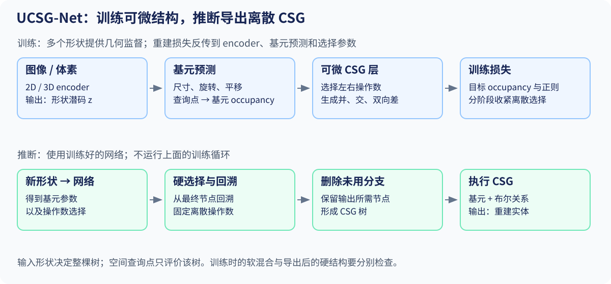
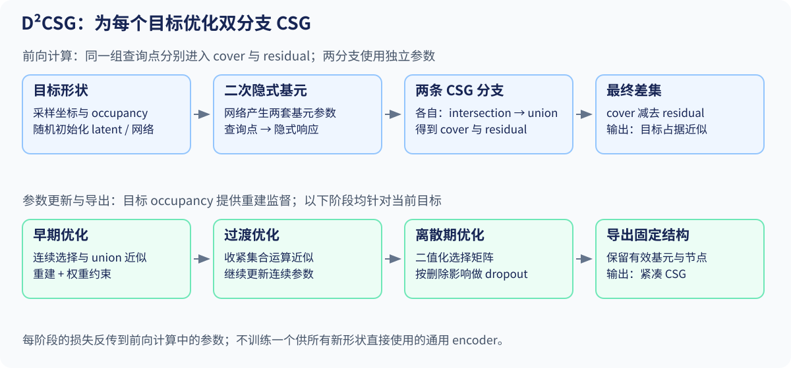

# 04 · UCSG-Net 与 D²CSG：学习离散构造结构

[总目录](README.md) · [上一章](03_superfit.md) · [下一章](05_cadfit.md)

## UCSG-Net

**文献：** Kania、Zięba、Kajdanowicz，NeurIPS 2020，Wrocław University of Science and Technology / Tooploox。[论文](https://arxiv.org/abs/2006.09102) · [正式会议 PDF](https://proceedings.neurips.cc/paper/2020/file/63d5fb54a858dd033fe90e6e4a74b0f0-Paper.pdf)。

### 1. 前置知识

先读 [第 02 章](02_math_and_optimization.md) 的 CSG、occupancy、几何损失和 Gumbel-Softmax。还需理解 encoder 将输入压缩为潜码 $z$，decoder 输出基元参数；查询点 $x$ 用于评价整棵树的占据，不能各自选择一棵树。

### 2. 动机

直接监督 CSG 生成需要真实程序树，而形状数据通常只有最终几何。已有离散程序搜索还可能依赖强化学习、beam search 和后续细化。论文研究：能否只用几何重建信号，学习一个从形状到基元与布尔结构的预测器？

### 3. 贡献

1. 用可微 CSG 层把基元预测与布尔组合接到同一重建目标上。
2. 以 Gumbel-Softmax 选择左右操作数，并生成四类运算结果供后续层组合。
3. 通过分阶段训练把连续松弛收紧为可回溯的离散 CSG 结构。

对应正文 §2.1–2.2、Fig. 3；二维和三维自编码实验分别检验重建能力。

### 4. 方法流程 / Pipeline

**输入：** 二维图像或三维体素。**输出：** 基元参数与离散 CSG 树。**训练：** 跨形状训练 encoder/decoder；**推断：** 前向预测、结构回溯、执行。

正文 §2.1 的输入经 2D/3D encoder 得到潜码 $z$，预测盒子、球等基元的尺寸、平移与旋转。在查询点计算基元距离，再转换成 occupancy。**结构参数由形状潜码决定，不随空间查询点任意变化**；否则每个点都选自己的树，就不再是一个统一的 CSG 程序。

#### 4.1 距离转 occupancy

正文 Eq. (1)：

$$
o(x)=\operatorname{clip}\left(1-\frac{d(x)}{\alpha},0,1\right),\qquad\alpha>0.
$$

内部及表面 $d\leq0$ 时为 1，外部在宽度 $\alpha$ 的带中逐渐降到 0。它不是 sigmoid。减小 $\alpha$ 可以接近二值化，但也缩窄有梯度的区域。

#### 4.2 在二值 occupancy 上推导运算

正文 Eq. (2)：

$$
o_{A\cup B}=\operatorname{clip}(o_A+o_B,0,1),
$$

$$
o_{A\cap B}=\operatorname{clip}(o_A+o_B-1,0,1),
$$

$$
o_{A\setminus B}=\operatorname{clip}(o_A-o_B,0,1).
$$

当输入严格属于 $\{0,1\}$ 时可逐项验证真值表；当输入为连续值时，它们是松弛，不是概率独立假设下的并交公式。例：$o_A=o_B=0.6$，这里并为 1、交为 0.2；独立概率的并与交则为 0.84、0.36，含义不同。

#### 4.3 究竟选择的是操作还是操作数？

潜码与可学习 keys 产生左、右操作数概率，经 Gumbel-Softmax 得到权重：

$$
\hat w_i=\frac{\exp((\log v_i+g_i)/\tau)}{\sum_j\exp((\log v_j+g_j)/\tau)},
\qquad g_i\sim\operatorname{Gumbel}(0,1).
$$

操作数是候选场的加权和。对选出的左右操作数，网络生成并、交、两个方向的差四种结果，供后续层使用；不是简单地给每个节点预测一个四分类标签就结束。原始基元会跳接到后续层，GRU 更新用于选择的潜码信息。见正文 Eqs. (3)–(7)、Fig. 3。

**数学提醒：** 低温极限可以接近离散选择，但有限温度软样本的期望一般依赖温度，不应把“Gumbel-max 的类别分布”误认为“任意温度下软向量均值完全不变”。

#### 4.4 两阶段训练与离散执行

第一阶段以 occupancy MSE、几何参数约束、平移约束与 $|\alpha|$ 项学习重建。第二阶段在 $\alpha$ 足够小时进一步压低选择温度，使操作数趋于 one-hot。正文 §2.2 Eqs. (8)–(12) 给出训练过程。

推断时沿最终输出回溯所选节点，取离散操作数，删除未使用分支，并实际用基元与布尔关系重建。若软输出很好而硬输出很差，就说明松弛没有顺利落到合法结构。

### 5. 实验

**数据与协议。** 正文 §4.1 使用 8,000 个 CAD 形状渲染的 $64\times64$ 二值图，类别为 chair、desk、lamp；按 CSG-NET 的同一 validation split 比较。§4.2 使用 ShapeNet 13 类的 $64^3$ 体素训练 3D autoencoder，监督查询点为 16,384 个；评测表面采样 4,096 点。无监督指无真实 CSG 树标签，仍有几何重建监督。

**二维主结果（Table 1，CD ↓）。** 下表保留原文报告尺度；二维轮廓 CD 与三维表面 CD 不跨表比较。

| 方法 | 搜索/细化 | CD ↓ |
|---|---|---:|
| CSG-NETSTACK，RL | beam=1，无细化 | 1.27 |
| CSG-NETSTACK，RL | beam=10，细化至收敛 | 0.34 |
| UCSG-Net | beam=1，无细化 | 0.32 |

**三维主结果（Table 2，CD ↓）。**

| UCSG-Net | VP | SQ | BAE | BSP-Net |
|---:|---:|---:|---:|---:|
| 2.085 | 2.259 | 1.656 | 1.592 | 0.446 |

三维实验表明该结构能恢复主要部件，但表面精度低于 SQ、BAE、BSP-Net；作者将其定位为有限基元、可解释的结构抽象。正文 §4.2 报告单样本 CSG 推断 0.068 s，libigl 几何重建 1.68 s，两者属于不同步骤。

**消融与报告边界。** Table 1 改变 baseline 的 beam/refinement，不能作为 UCSG-Net 自身 Gumbel-Softmax 或 GRU 模块的独立消融。正文主实验未给出完整的逐模块删除消融表。本章不据主表单独量化这些模块的收益。CD 沿用原文评价实现；主表未单列执行失败率，不将其解释为 100% 有效。

### 6. 局限性

球、盒等基元与有限 CSG 层数约束了表示容量；细薄部件和复杂曲面容易丢失，三维主表反映了这一精度限制。软操作数在低温下离散化，仍可能出现软重建到硬结构的质量落差。缺少真实树监督也意味着所得树不必等于设计者的树，训练分布外的稳定性需另行验证（正文 §4.2–5；后两点为讲义分析）。

## D²CSG

**文献：** Yu 等，NeurIPS 2023，正式会议版署名机构包括 Simon Fraser University 和 Amazon。[会议入口](https://proceedings.neurips.cc/paper_files/paper/2023/hash/4732d425125832887f6c5a9675d49ead-Abstract-Conference.html) · [正文 HTML，arXiv v2](https://arxiv.org/html/2301.11497v2)。

### 1. 前置知识

先读 [第 02 章](02_math_and_optimization.md) 的集合补集、交并差、隐式场与 occupancy。还需知道 quadric 是二次隐式多项式，DNF 是“若干交集的并集”，以及可学习选择矩阵如何用连续权重近似离散连接。

### 2. 动机

固定的“交—并”结构难以紧凑表示复杂凹部；最终差集的两个操作数若共用基元，优化时会互相干扰；过量候选又容易产生冗余。论文希望在无真实 CSG 标签条件下，同时提高表达能力、重建精度与结构紧凑性（正文 §1、§3）。

### 3. 贡献

1. **Complementary primitives：** 同时允许凸区域与反向区域，扩展固定层次结构能表达的布尔集合。
2. **Dual branches：** cover 与 residual 各用独立基元，降低最终差集两侧的参数耦合。
3. **Dropout：** 离散期按删除影响裁掉基元和中间形状。

三个设计在正文 Table 3 中以 CP、DB、DO 消融；总体结构见 §3。

### 4. 方法流程 / Pipeline

**输入：** 目标形状及其查询点几何监督。**输出：** 由两分支组成、经过剪枝的 CSG 结构。**执行：** 为每个目标重新优化 latent 与小网络。

与 UCSG-Net 的 encoder 路线不同，D²CSG 为每个目标形状联合优化随机初始化的 latent code 和小型网络，不应被写成一次前向的通用预测器。正文 §3 和 §4 明确说明逐形状优化。

整体结构为：

$$
S=S_C\setminus S_R,\qquad
S_C=\bigcup_j\bigcap_{i\in I_j}P_i,\quad
S_R=\bigcup_k\bigcap_{i\in J_k}Q_i.
$$

这是**集合层面的讲义表示**。cover 与 residual 使用分开的基元参数；每个分支同时允许凸基元及其反向区域，使内部相交结构也能表达更一般的非凸形状。

#### 4.1 七参数 quadric 与距离近似

正文 §3.1 的凸基元采用：

$$
q(x,y,z)=|a|x^2+|b|y^2+|c|z^2+dx+ey+fz+g.
$$

另一半基元将前三项系数取负。它们是两类可学习的参数化区域，不要求每一对都严格共享参数并互为精确相反数。没有 $xy,xz,yz$ 交叉项，所以不能把此形式叫作任意方向的一般十系数二次曲面。

查询矩阵 $Q$ 的每行为 $(x^2,y^2,z^2,x,y,z,1)$，计算 $D=QP^T$。论文称其为 approximated signed distance；从表达式看它是二次隐式值，**不是精确欧氏距离**。

#### 4.2 用矩阵表示交与并

设 $T\in\mathbb R^{p\times c}$ 选择哪些基元进入哪些交集，正文 Eq. (2)：

$$
\mathrm{Con}=\operatorname{ReLU}(D)T.
$$

当 $T$ 二值且列非空时，一个查询点对该列所有选中基元都满足 $D\leq0$，其 Con 才等于 0。因此零表示“位于交集内部”。再用行最小值表示并集，正文 Eq. (3)：

$$
a^*(x)=\min_j\mathrm{Con}(x,j).
$$

**边界情况：** 空交集按数学约定对应全域，简单求和会给全零。导出结构时要跟踪哪些中间节点有效，不能把全零列当成普通实体忽略。

早期使用可学习加权、裁剪的 union 近似，让更多候选获得梯度；后期切换到 min 并离散化 $T$。正文叙述称 Stage 0–2，但 Table 1 行标为 1–3；本章称“早期、过渡、离散期”，避免把同一阶段错当成两个阶段。

#### 4.3 为什么 final difference 不是直接用两份距离相减？

$a_C^*,a_R^*$ 为“内部零、外部正”的响应，不是内部负的 SDF。正文 Eq. (5) 使用 margin $m$（原文记作 $\alpha$）：

$$
s^*(x)=\max(a_C^*(x),m-a_R^*(x)).
$$

原文以 $s^*<m/2$ 判为内部。若一个点位于 cover 内且 residual 内，$a_C^*=a_R^*=0$，则输出 $m$，被排除；若位于 cover 内且充分远离 residual，则输出为 0，被保留。这是在该隐式响应尺度上的差集近似，不是直接拿第 02 章 SDF 公式套上两个 occupancy。

#### 4.4 Dropout 在这里是什么？

离散期评估删除某个基元或中间形状后，查询点占据是否改变，影响足够小才通过置零相关选择权重移除。正文 Eqs. (6)–(7) 描述重要性与屏蔽操作。这是结构删减机制，不能只解释成普通训练时随机隐藏单元以防过拟合。

仅对有限采样点无影响，不代表连续空间处处不变。薄壁、小孔可能落在采样之外，这也解释了为什么应检查表面、特征和不同采样分辨率。

#### 4.5 分阶段优化与导出

Table 1 给出三阶段：早期让 intersection / union 权重连续，优化重建损失与选择权重约束；过渡阶段用更接近集合运算的 union/difference 响应并保留连续 intersection；离散期二值化结构、启用 dropout，只优化重建项。查询点的目标 occupancy 提供监督，梯度更新基元参数及网络/latent；最后将有效节点与选择关系导出为固定 CSG 结构。重建项的分阶段具体形式见正文 §3.3，不能把最终场误当成精确 SDF 回归。

### 5. 实验

**设置。** 正文 §4 从 ABC 选 500 个形状，从 ShapeNet 13 类各选 50 个，共 650 个；ABC 中 80% 样本 genus > 2 且顶点数 > 10K。它们是逐形状优化的评测集合。每个目标使用 24,576 个近表面点和 4,096 个空间点及 occupancy；网络与 latent 随该目标优化。基线 BSP-Net、CSG-Stump、CAPRI-Net 的预训练初始化与 D²CSG 不同，原文控制优化迭代数量进行比较。

**指标。** CD ↓、法线一致性 NC ↑、边缘 CD（ECD）↓ 衡量重建，基元数量 #P ↓ 衡量紧凑性。CD/ECD 用 8K 表面点，数值乘 1,000 后报告；不能与其它论文的 CD 数值直接比较。

**Mesh-to-CSG 主结果（Table 2，作者报告）。**

| 数据 | 方法 | CD ↓ | NC ↑ | ECD ↓ | #P ↓ |
|---|---|---:|---:|---:|---:|
| ABC | CAPRI-Net | 0.177 | 0.903 | 3.990 | 66.26 |
| ABC | D²CSG | 0.069 | 0.928 | 3.091 | 28.62 |
| ShapeNet | CAPRI-Net | 0.124 | 0.890 | 2.035 | 50.94 |
| ShapeNet | D²CSG | 0.119 | 0.887 | 1.722 | 43.78 |

ShapeNet 的 NC 略低，不能概括成全部指标最优。Table 4 另评估点云输入，与上表 Mesh 协议分开。

**消融（Table 3）。** 同时具有 complementary primitives 和 dual branches 时，不用 dropout 的 CD=0.069、NC=0.936、#P=53；加入 dropout 后 CD=0.069、NC=0.928、#P=29。该结果支持剪枝能显著压缩结构，也显示法线质量存在取舍。表中基元数为消融表的取整值。

**成本与失败。** 正文 §4.1 报告 RTX 2080 Ti 上每个形状约 5 分钟、每阶段 12,000 次迭代；不是一次前向推断。主表没有另列 invalid ratio，不能据此推断失败率为零。

### 6. 局限性

**表达与优化限制。** 七系数二次隐式基元没有交叉项；给定基元和中间节点预算下，细节、方向与结构复杂度都有上限。正文 §5 讨论表示与优化的限制；逐形状计算成本见 §4.1。

**采样限制（讲义分析）。** Dropout 在采样点上近似不改变 occupancy，不能保证连续空间小孔和薄壁不变。

**讲义推导：** 任意有限布尔公式可用 De Morgan 律把非运算向叶节点推动，并化为若干 literal 交集的并集（DNF）。允许基元与其补集是这种表达能力的关键。但 DNF 可能指数膨胀；固定的基元和中间节点预算不能保证紧凑表达所有任意复杂形状，优化也未必找到可表达的解。

这说明四件事不同：存在一种表达、指定预算容得下、优化找到它、它是最短程序。对论文 generality 的理解应落在其基元集合与布尔结构假设下。

## 两篇论文的对照

| 维度 | UCSG-Net | D²CSG |
|---|---|---|
| 推断组织 | 形状 encoder 与可微 CSG 层 | 每个目标优化 latent 与小网络 |
| 几何叶节点 | 可解析距离的球、盒等 | 受符号约束的二次隐式基元 |
| 离散结构 | 操作数选择与逐层组合 | 双分支内 intersection/union 选择矩阵 |
| 差集 | 层内生成双向差 | 最终 cover-residual，并含反向基元 |
| 紧凑性机制 | 回溯删除未用节点 | 离散期按删除影响压缩结构 |
| 主要风险 | 松弛到离散的落差、深度限制 | 单形状优化成本、采样与容量限制 |

## 阅读定位与习题

UCSG-Net：Fig. 3 → §2.1–2.2 → Tables 1–2 → §4.2–5。D²CSG：§3.1–3.3 → Table 1 → Tables 2–4 → §5。表格摘录以本地 PDF 为准，均为作者报告，本讲义未复现。

1. 对 $(o_A,o_B)=(1,0),(1,1),(0,1)$ 验证 UCSG-Net 三种布尔公式。
2. 为什么操作数权重不能随查询点任意改变？
3. 在 D²CSG 中，若某列 $T$ 全零，对应的 Con 是什么？应如何理解？
4. 用 De Morgan 律改写 $A\setminus(B\setminus C)$，并说明为什么需要补集。
5. 为什么“删掉一个基元后 1000 个点的 occupancy 不变”不能证明连续形状完全不变？

6. 对一个新的目标，UCSG-Net 和 D²CSG 分别需要执行哪些步骤？为什么不能直接比较它们的单次网络前向耗时？

[答案与提示](exercises_and_answers.md)
