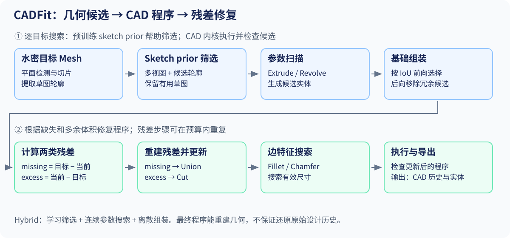

# 05 · CADFit：从 Mesh 到 CAD 操作序列

[总目录](README.md) · [上一章](04_neural_csg.md) · [下一章](06_zero_to_cad.md)

**核心论文：** Nehme、Whalen、Ahmed，*CADFit: Precise Mesh-to-CAD Program Generation with Hybrid Optimization*，2026。[arXiv v3](https://arxiv.org/abs/2605.01171v3) · [正文与附录](https://arxiv.org/html/2605.01171v3)。本章按 2026-06-07 的 v3 撰写，发表状态保守记为预印本。

## 1. 前置知识

先读 [几何表示](01_representations.md) 的 Mesh、B-rep 和裁剪拓扑，以及 [数学与优化](02_math_and_optimization.md) 的 CSG、Chamfer Distance 和 IoU。

本章中的 CAD 程序是有序操作序列。操作 $o_t=(\tau_t,\theta_t,\mathcal R_t)$ 包含类型、参数及对已有几何的引用；重执行时必须按依赖关系解析引用。

| 操作 | 作用 | 需要知道什么 |
|---|---|---|
| Sketch | 定义二维封闭轮廓 | 平面、曲线、环及孔 |
| Extrude | 沿方向拉伸轮廓 | 轮廓、方向、距离 |
| Revolve | 绕轴旋转轮廓 | 轮廓、轴、角度 |
| Union / Cut | 添加 / 去除体积 | 已有实体和工具实体 |
| Fillet | 将边附近转为圆滑过渡 | 目标边、半径、有效邻域 |
| Chamfer | 在边附近生成倒角 | 目标边、距离或角度 |

这里 Sketch 用于构造操作的输入，不是正文六类实体操作词表中的额外一类。

## 2. 动机

一个 CSG 表达式可能是“盒子减圆柱”，一个 CAD 程序则可先定义二维轮廓，在工作平面上拉伸，再基于某个面或边添加特征。程序的后续步骤依赖先前生成的实体、轮廓与引用。

正文 §3 将操作表示为 $o_t=(\tau_t,\theta_t,\mathcal R_t)$：类型、连续参数、引用。词表为 Extrude、Revolve、Fillet、Chamfer、Union、Cut。输入假设是能解释为体积的水密 Mesh；不是直接对任意含洞扫描网格保证成功。


**教学例子：** 带孔底座可以“拉伸矩形再切圆孔”，也可以“拉伸带内环的二维轮廓”。最终实体相同，操作序列不同。仅最小化几何误差无法识别真实历史。

因此 CADFit 正文 Eq. (1) 的目标是寻找有效程序空间中的高 IoU 解：

$$
\Pi^*=\arg\max_{\Pi\in\mathcal S_{\mathrm{valid}}}
\operatorname{IoU}(\operatorname{Solid}(\Pi),M).
$$

这不是原始设计者历史的唯一恢复定理。有效性约束与候选生成共同决定哪些程序可以被找到。

## 3. 贡献

依据正文 §3、Algorithm 1，贡献可分为：

| 贡献 | 方法中的位置 | 验证 |
|---|---|---|
| 几何驱动的 CAD 程序搜索 | 草图提取、连续参数扫描、离散候选组装 | Table 1 的 Mesh-to-CAD 重建 |
| 双残差修复与边特征拟合 | missing / excess 的 Union / Cut，以及 Fillet / Chamfer 搜索 | Algorithm 1、Appendix N 与定性结果 |
| Learned sketch prior | 用几何搜索产生的标签学习候选草图筛选 | Table 4 的质量与运行时间消融 |

“Hybrid”对应学习型候选筛选、连续几何参数搜索和离散程序组装的结合；CAD 内核负责执行与几何合法性检查。

## 4. 方法流程 / Pipeline

**输入：** 可作体积运算的目标 Mesh。**输出：** 可执行 CAD 操作序列及其实体。**执行方式：** 逐目标搜索；sketch prior 是预先训练的候选筛选器。



候选阶段输出轮廓与参数化实体；组装阶段输出基础程序；残差循环更新该程序；末尾拟合依赖已有边的圆角和倒角。

### 4.1 从三维几何提出二维草图

正文 §3、Appendix I–J。算法从近似平面区域以及切片中提取轮廓，投影到局部平面，组织轮廓环，再拟合适合 CAD 草图的曲线。

先有候选，才有选择。若真实零件的重要轮廓没有出现在候选里，后续 IoU 搜索再好也找不到对应操作。扫描噪声、曲面近似和平面检测阈值会影响这一上限。

**学习型 sketch prior：** 对目标 Mesh 的多视图渲染叠加候选轮廓，经 DINO encoder 与小 MLP 估计该轮廓的有用程度。正负标签来自纯优化流水线最终使用与未使用的草图。推断时以预测概率进行随机筛选，见 Appendix M。它加速候选搜索，不是端到端直接预测全部 CAD 历史。

### 4.2 连续扫参数，离散存候选

对候选轮廓 $g$ 及操作参数 $\theta$，正文 §3 和 Appendix K 定义单向平方 Chamfer：

$$
\mathcal D(\theta)=\frac1{|P(g,\theta)|}\sum_{x\in P(g,\theta)}
\min_{y\in Q(M)}\|x-y\|_2^2.
$$

此处 $P$ 是候选操作生成的表面点，$Q$ 是目标表面点。算法扫拉伸长度或旋转参数，识别误差突增前的稳定区间，形成少量候选。它不是在整个 CAD 内核上做端到端可微反向传播。

**教学直觉：** 拉伸薄板时，长度尚在目标支撑范围内，候选与目标表面较匹配；穿出目标后，多余表面使单向误差变大。单向项适合检查候选是否“超出去”，但不能独自检查整个目标是否被覆盖，后续需要体积 IoU 组装。

### 4.3 前向加入，后向删减

设当前实体 $S$，候选 $c$，正文 §3、Appendix L Algorithm 7：

$$
c^*=\arg\max_c\left[\mathrm{IoU}(S\cup c,M)-\mathrm{IoU}(S,M)\right].
$$

有正收益就加入，直到没有候选改善 IoU。然后尝试删除已选候选，重执行剩余子程序；若删去不降低 IoU，就移除冗余。

**研究判断：** 贪心只保证当前候选下的局部选择准则，不保证最短程序或全局最优 IoU。有些候选必须组合后才有收益，单独看可能被错过。也不能把复杂的历史程序任意重排；此处基础组装的 union 候选与后面的带引用特征应区分。

### 4.4 用两种残差纠错

正文 Algorithm 1：

$$
R^+=M\setminus S,\qquad R^-=S\setminus M.
$$

$R^+$ 是少造的材料，重建后以 Union 加回；$R^-$ 是多造的材料，重建后以 Cut 去掉。反复使用同一单次重建过程，直到残差体积够小或达到预算。

```text
program, solid = reconstruct_once(target)
repeat within budget:
    missing = target minus solid
    excess = solid minus target
    if both residual volumes are small: stop
    reconstruct missing and excess
    update program with Union(missing_program), Cut(excess_program)
    execute and validate the updated solid
return program
```

这是**教学伪代码**。几何差集、容差、候选执行失败等处理应以选定版本代码为准。

#### 与 SuperFit 的 residual 有何不同？

两者都让当前误差影响后续结构提案；SuperFit 的主线是解析基元软并装配与全体参数重优化，CADFit 则在 CAD 操作层面明确构造 missing/excess，用 Union/Cut 修复。相似的是反馈思想，输出语言和执行方式不同。

#### 小圆角与倒角怎样恢复？

Appendix N：对重建实体的候选边施加小幅 Fillet 或 Chamfer，检查 IoU 是否改善；若改善，再对半径或长度做一维搜索。它们依赖前面产生的边与实体，因此不是可以任意放进独立 primitive soup 的形状。

## 5. 实验

**设置与基线。** 正文 §4 在 DeepCAD complex、Fusion360 以及按 STEP 面数分层的 ABC 子集上评测，每个子集 300 个目标；这属于测试集合，不能与 sketch prior 的训练样本混用。Table 1 包括 GenCAD-3D、CAD-Recode、Cadrille 等基线，下面摘录 Cadrille 与 CADFit。IoU ↑、CD ↓、Invalid Ratio（IR）↓ 分别报告体积质量、表面质量和程序失败比例。

### 5.1 主结果与指标口径

正文 Table 1 的选取数据如下，均为作者报告，未在本讲义复现：

| Mesh-to-CAD 子集 | Cadrille IoU | CADFit IoU | CADFit IR |
|---|---:|---:|---:|
| DeepCAD complex，300 个 | 0.872 | 0.964 | 0.000 |
| Fusion360，300 个 | 0.817 | 0.921 | 0.000 |
| ABC Hard，300 个 | 0.438 | 0.662 | 0.000 |

ABC Hard 按 STEP face count 为 151–1500 定义；Easy 为 1–15，Medium 为 16–150。这个分层是几何复杂度代理，并不等于人工标注的设计难度。

Appendix B 的评价会先用平移、旋转和整体尺度做相似变换对齐。CD 为**未平方欧氏距离的双向平均**，与第 02 章教学用 $\mathrm{CD}_2$ 不同；IoU 使用实体布尔交并的体积比。IR=0 是该测试集合中的观察，不是对所有未来输入的有效性保证。

Image-to-CAD 使用上游图像到 Mesh 模型及水密化、平滑、简化等处理，再应用 CADFit。Table 2 的结果不能归因于 CADFit 单独从图像恢复了三维信息。

### 5.2 Learned sketch prior 消融

Table 4 比较可承受的候选预算下，随机抽取 100 个 loops 与 learned prior 筛选。正数表示加入 prior 后 IoU 增加；运行时间单位为秒。

| ABC 子集 | IoU 变化 | 无 prior 时间 | 有 prior 时间 | 加速 |
|---|---:|---:|---:|---:|
| Easy | −0.0033 | 303.0 | 213.3 | 1.42× |
| Medium | +0.0032 | 396.1 | 244.4 | 1.62× |
| Hard | +0.2285 | 903.7 | 311.8 | 2.90× |

它支持“有限候选预算下，学习筛选能节约搜索并改善困难样本”的结论。Easy 的 IoU 略降，不能说所有子集的所有指标都改善。

### 5.3 程序长度与失败口径

正文 Table 3 在 300 个 DeepCAD complex 样本中报告 69.8% 同时取得最高 IoU 和最短有效序列。几何质量与程序长度是两个评价轴，短程序并不自动等于真实历史。IR 单独报告无效程序。Appendix B 给出 CD/IoU 的几何计算，但没有明确给出失败样本计入均值的规则；这里保留原表口径，不自行把失败补零或声称它是全样本均值。

## 6. 局限性

噪声、缺失轮廓、曲面范围和操作词表决定表示上限；复杂形状的候选搜索与内核执行有成本；高 IoU 不证明孔径公差、制造可行性或原始设计意图已恢复。正文 §5 和 Appendix F 的失败案例比摘要的整体结论更值得细读。

## 阅读定位与习题

阅读顺序：Fig. 2 → §3 → Algorithm 1 → Appendix I/K/L/N → §4.2–4.3 → Table 1 → Appendix F。

1. 给带孔底座写出两个最终几何相同但操作历史不同的程序。
2. 预测底座填满了本应存在的孔，错误属于 $R^+$ 还是 $R^-$？该使用什么布尔操作？
3. 为什么候选生成可用单向 CD，而最终组装仍要检查整体体积？
4. 为什么恢复某条边的圆角半径不是一个脱离上下文的标量回归任务？
5. 论文报告 IR=0 能否证明输入开放扫描网格也一定得到有效程序？

6. Table 4 的 no-prior 基线如何选草图？为什么这组消融的结论必须包含候选预算条件？

[答案与提示](exercises_and_answers.md)
