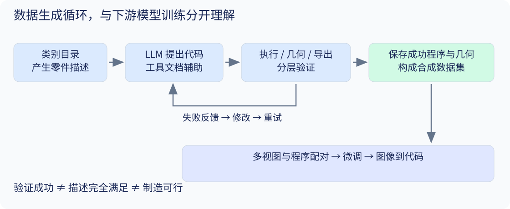

# 06 · Zero-to-CAD：把执行反馈变成训练数据

[总目录](README.md) · [上一章](05_cadfit.md) · [下一章](07_landscape.md)

**核心论文：** Ataei、Askari、Malekshan、Jayaraman，Autodesk Research，2026。[arXiv v1](https://arxiv.org/abs/2604.24479v1) · [正文](https://arxiv.org/html/2604.24479v1) · [官方模型与数据入口](https://huggingface.co/ADSKAILab/Zero-To-CAD-Qwen3-VL-2B)。本章按已核验版本记为预印本，不把评审中的稿件称为已录用。

## 学习目标

区分“合成程序的数据引擎”和“用数据训练的重建模型”；理解两阶段生成、工具修复、几何筛选与多视图监督；识别成功样本条件指标的含义。

## 1. 解决的首先是数据缺口

训练 Mesh 生成器需要几何样本，训练 CAD 程序生成器则需要可执行的构造过程。Mesh 或 B-rep 通常只给最终几何，不能直接充当完整构造代码的监督。

Zero-to-CAD 用 LLM 的先验提出设计与代码，再通过执行反馈修复和筛选。其“Without Real Data”指合成过程不依赖真实 CAD 构造历史作为该数据集的来源，**不是基础 LLM 从未接触真实世界知识或预训练数据**。

## 2. 两个阶段，不要混成一个模型

### 2.1 数据生成时：描述 → 代码 → 工具反馈

正文 §4.1–4.4：先按类别产生零件描述目录并去重，再依据描述生成 CadQuery 程序。生成代理使用 gpt-oss-120b；工具包括执行与验证、TF-IDF 文档查找和正则检索。

出现语法或几何错误时，把错误反馈给生成模型，再查 API、改代码、重新执行。正文设置有限的回合与尝试预算，避免无限修复。类别条件与参考代码模式用于增加操作与结构覆盖，成功程序及几何产物被保存。

**教学例子：** 描述是“带两个贯穿孔的安装底座”。程序若成功生成底座但忘记孔，语法执行器并不会自动知道语义遗漏；若孔径太大导致实体断开，连通性检查可能发现问题。不同验证器捕获不同错误。

### 2.2 下游训练时：多视图 → 代码

正文 §6 使用八张 $256\times256$ 渲染图与程序配对，微调 Qwen3-VL-2B-Instruct。训练目标可用下面的**讲义标准序列建模形式**理解：

$$
L_{\mathrm{NLL}}=-\sum_t\log p_\phi(c_t\mid c_{<t},I_1,\ldots,I_8).
$$

这不是论文另提出的特殊损失。模型训练后一次生成代码；不能把数据生成阶段有代理修复循环，误写成每次下游预测都运行同样的长修复过程。

## 3. 三层验证各自保证什么？

| 层次 | 论文检查 | 仍不能证明什么 |
|---|---|---|
| 代码执行 | 有限时长内执行、捕获异常、取得实体 | 几何有效、描述满足 |
| 几何 | 拓扑有效、单连通实体、正体积、最低面数 | 尺寸公差、强度、加工可行性 |
| 导出 | STL 与 STEP 能成功导出 | 原始设计意图和用户可理解性 |

正文 §4.3 排除少于 7 个 B-rep 面的简单结果，并要求一个连通实体。**研究判断：** 这是数据分布的取舍，不是“所有六面体都不是好 CAD”；简单标准件和多实体装配可能有价值，但不属于这个筛选目标。

论文自己明确区分几何有效性和完整 DFM。可读可编辑主要指命名参数和逻辑步骤，并没有以用户研究验证普遍的可理解性（正文 §1）。因此讲义不把“变量名明确”升级为“工程师修改一定成功”。

## 4. 多样性不能只看样本总数

正文 Table 2 报告 999,633 个可执行程序。§4.6 通过多视图视觉嵌入聚类，选取靠近簇中心的代表，形成 100,000 个精选样本。

这能提高视觉覆盖，但视觉嵌入近似不等于程序语义近似：外形相同可以由不同操作历史生成，外形近似也可能具有不同关键尺寸。评价合成数据还应检查代码重复、几何重复、类别分布、操作分布以及分割间的近邻泄漏。本句是讲义研究判断，不是声称论文已经发现泄漏。

## 5. 精读 Table 4：成功率和成功条件下的质量

正文 §6.1：Qwen 在完整 10,000 个 Zero-to-CAD 测试样本上评价，GPT 因成本在随机 1,000 个样本子集上评价。ABC OOD 为 1,000 个、7–100 个 B-rep 面的形状。不能把这个 OOD 子集称作全体 ABC。

表中 IoU 用 $64^3$ 体素，允许按 45° 间隔旋转以取最大值；几何指标**只在成功执行样本上计算**。以下是 Table 4 的作者报告摘录，本讲义未复现：

| 数据 | 模型 | 成功率 | 成功样本平均 IoU |
|---|---|---:|---:|
| Zero-to-CAD test | 微调 Qwen3-VL-2B | 82.1% | 0.747 |
| Zero-to-CAD test 子集 | GPT-5.2 High | 72.2% | 0.485 |
| ABC OOD | 微调 Qwen3-VL-2B | 61.0% | 0.377 |
| ABC OOD | GPT-5.2 High | 66.2% | 0.344 |

前两行支持专门的合成监督对该任务有帮助；后两行表明微调模型在成功样本上更贴近几何，但执行成功率更低。不能写成“在 OOD 上所有指标全面胜出”。

### 5.1 一个重要的统计推导

如果我们自定义“失败记 0”的全样本 IoU，则

$$
\mathbb E[\mathrm{IoU}_{0}]
=P(\mathrm{success})\,
\mathbb E[\mathrm{IoU}\mid\mathrm{success}].
$$

这是**讲义推导**，不是原表里的额外指标。以上 ABC 两行给出约 $0.610\times0.377=0.230$ 和 $0.662\times0.344=0.228$。使用已四舍五入的汇总数据只能近似计算，也不足以断言二者有统计显著差异。成功样本条件均值看起来明显不同，全样本效果却可能很接近。

## 6. 与 CADFit 的互补关系

CADFit 从目标几何搜索一个程序；Zero-to-CAD 的数据引擎从描述出发产生大量有效程序，随后用其训练几何/图像到程序的模型。

**研究设想：** 可以让快速模型先提出候选，再用几何拟合调整尺寸、用内核验证合法性，并把修正后的结果回流为训练数据。但这只是可能的组合方向，不是两篇论文已经验证的统一系统；要分别测质量、时间和数据偏差。

## 7. 阅读定位与习题

建议：Fig. 2 → §4.2 → §4.3 → §4.6 → §6.1 → Table 4 → Appendix D/E。读 prompt 时关注它要求什么，再追问执行器实际验证了什么。

1. 为什么成功执行率 100% 不能代表重建质量高？举一个退化生成策略。
2. 为什么“没有真实构造历史数据”不等于“没有任何真实数据或人类先验”？
3. 一个输出能导出 STEP，但孔的位置错了。它通过了哪一层检查？还需增加什么评价？
4. 模型 A 成功率 50%、成功样本 IoU 0.9；B 成功率 90%、IoU 0.6。按失败记零的口径比较。
5. 若按代码文件随机划分训练测试集，为什么还要检查几何近重复？

[答案与提示](exercises_and_answers.md)
